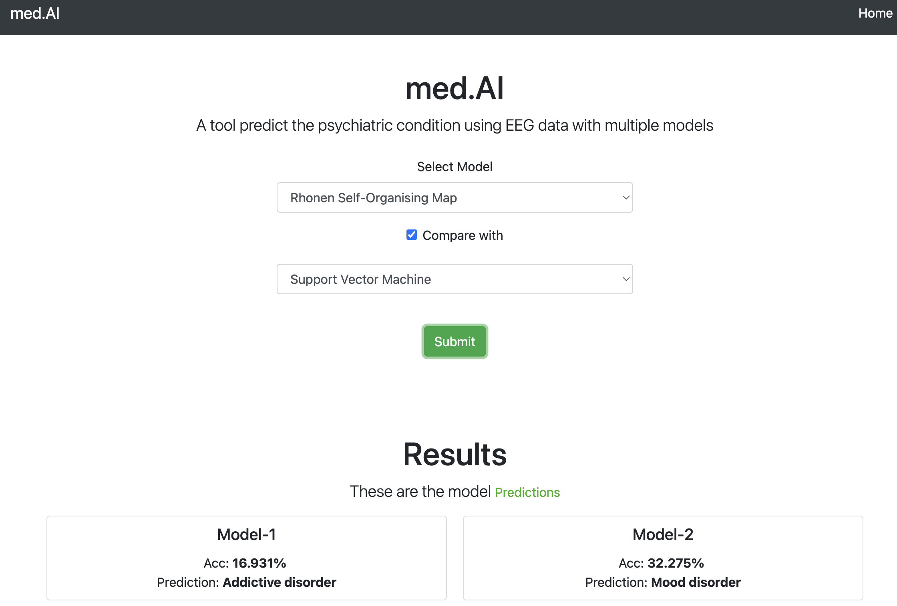

  <h3 align="center">med.AI</h3>

## Project Structure

- [x] Dataset & Initial research
- [x] Models Selection
- [x] Models Implementation
- [x] Web Interface
    - [x] Frontend (html, css, js, Jquery, Bootstrap)
    - [x] Backend 
        - [x] API (python3, uvicorn, FastAPI)
        - [x] Models (ipynb -> .py)
- [ ] Model Tuning
-----
## Dataset & Initial research

Few points regarding the dataset include some screenshots.

-----

## Models Selection

Explain about the models selection process.

-----
## Models Implementation

List out the libraries and frameworks used and explain about the preprocessing and fine tuning.