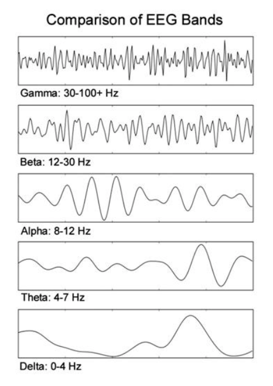

## Datasets
---
1) General Datasets:
HealthData.gov,
Big Cities Health inventory Data Platform,
Chronic Disease Data,
Human Mortality Database,
Mental Disorders Datasets,
MHealth Dataset,
Medicare Provider Utilization and Payment Data,
Life Sciance Database Archive,
WHO (World Health Organisation),

2) Image Datasets:
Open Access Series of Imaging Studies (OASIS),
OpenfMRI,
Alzheimer's Disease Neuroimaging Initiative (ADNI),

3) Covid Datasets:
COVID-19 Open Research Dataset,
COVID-19 in India,
COVID-19 Radiology Dataset,

4) Genome Datasets:
GEO Datasets,
1000 Genomes Project,
Genome in a Bottle,

5) Hospital Datasets:
Medicare Hospital Quality,
Healthcare Cost and Utilization Project (HCUP),
MIMIC Critical Care Database,

6) Cancer Datasets:
SEER cancer incidence,
BROAD Institute Cancer Program Datasets,
CT Medical Images,

###  Dataset Selection
---
*Category* : Mental Disorders Datasets 

*Name* : EEG psychiatric disorder dataset

*Source* : https://osf.io/8bsvr/

### Some statistics
---
https://www.macadamian.com/learn/a-practical-application-of-machine-learning-in-medicine/

## Algorithms 
---
* Random forest
* SVC
* MLP
* RNN
* Naive Bayes

## Pattern analysis in the EEG data (Crucial)

</img>

1. Selecting a base model for the EEG performance analysis
2. Recognising patterns in the alpha, beta, gamma, theta and delta is quite complex because of the unusual noise present in some bands.
3. Multi class classification task.
4. Predicting the main disorder using all the features
